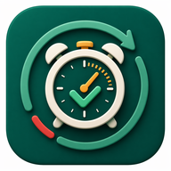

<div align="center">



# KeepOn

**Stay aware. Finish before time runs out.**

A Flutter task reminder app that keeps unfinished work visible with persistent local notifications and activity-aware reminder timing.

</div>

---

## Problem

Many task apps are good at recording what needs to be done, but not at keeping unfinished work present. A task can be written down, dismissed once, and then quietly disappear from attention until the deadline has already passed.

KeepOn is designed for time-bound tasks that should keep resurfacing until they are completed or expired. It gives users a lightweight task list, repeated local reminders, quiet hours, and simple activity-aware scheduling without turning the app into a full project-management tool.

## Core Features

- **Create and edit tasks** with a title, optional description, start time, and end time.
- **Track active work** from the home screen with a next-focus panel, urgency colour, progress bar, and remaining-time label.
- **Complete or delete tasks** directly from the task list.
- **Persistent local reminders** using scheduled device notifications.
- **Quiet hours** so reminders avoid user-defined rest periods.
- **Activity-aware reminder timing** using accelerometer data to detect when the device has been stationary.
- **Local storage** for tasks and settings using Hive and SharedPreferences.

## User Flow

```text
1. Launch KeepOn
   The app opens with a short branded splash screen.

2. Create a task
   The user enters a title, optional notes, start time, and end time.

3. Return to the home screen
   The new task appears in the active list and the next-focus panel updates.

4. Receive reminders
   KeepOn schedules repeated notifications while the task is active and incomplete.

5. Adjust settings
   The user can change reminder interval, enable/disable notifications, and set quiet hours.

6. Finish the task
   Marking a task complete removes it from the active list and stops its reminders.
```

## Screenshots And Demo

| Screen 1 | Screen 2 |
|:--:|:--:|
|  |  |

| Screen 3 | Screen 4 |
|:--:|:--:|
|  |  |

**Demo video:** [Watch demo.mp4](screenshots%20%26%20demo/demo.mp4)

1. Launch the app.
2. Create a new task.
3. Show the task on the home screen.
4. Open settings and adjust reminder options.
5. Mark the task complete.

## Getting Started

### Prerequisites

- Flutter SDK with Dart 3.10 or later
- Android Studio or Visual Studio Code
- Android device or emulator

### Install

```bash
cd KeepOn
flutter pub get
```

### Run

```bash
flutter run
```

### Test

```bash
dart format lib test
flutter analyze
flutter test
```

### Build Debug APK

```bash
flutter build apk --debug
```
